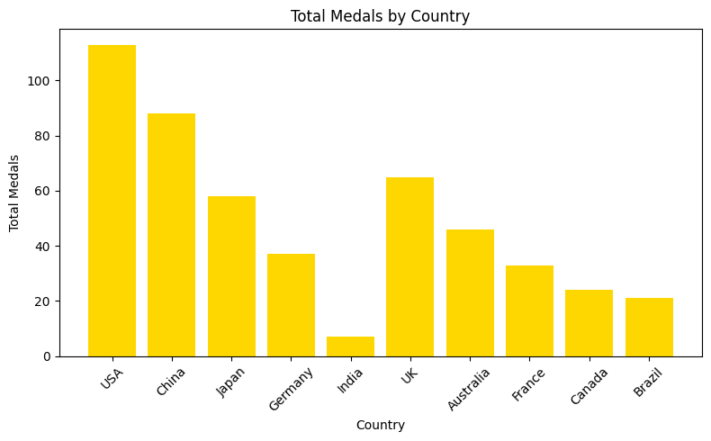
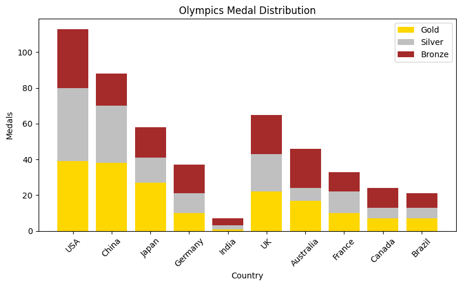

# olympics-medal-analysis
"A Python-based analysis of Olympic medal counts using Pandas, NumPy, and Matplotlib, featuring data cleaning, statistical insights, and visualizations in Google Colab."
# 🏅 Olympics Medal Analysis

This project analyzes Olympic medal counts for various countries using **Python, Pandas, NumPy, and Matplotlib** in a Google Colab notebook.  
It performs **data cleaning, statistical analysis, and visualizations** to identify top-performing countries.

---

## 📌 Features
- Clean and process medal data
- Calculate **total medals** per country
- Find countries with **most total medals** and **most gold medals**
- Compute **average gold medal count**
- Visualize results using **bar charts** and **stacked medal distribution charts**

---

## 🛠 Technologies Used
- **Python 3**
- **Pandas** – Data handling
- **NumPy** – Statistical analysis
- **Matplotlib** – Data visualization
- **Google Colab** – Cloud-based execution

---

## 📂 Dataset
Example dataset:

| Country   | Gold | Silver | Bronze |
|-----------|------|--------|--------|
| USA       | 39   | 41     | 33     |
| China     | 38   | 32     | 18     |
| Japan     | 27   | 14     | 17     |
| Germany   | 10   | 11     | 16     |

The dataset is created directly in the notebook, but it is also saved as **olympics.csv**.

---

## 📊 Visualizations

### **Total Medals by Country**

### **Medal Distribution (Gold, Silver, Bronze)**

---

## 🚀 How to Run
1. Click the **"Open in Colab"** badge at the top of this README.
2. In Colab, click **Runtime → Run all** to execute all cells.
3. View outputs and charts directly in the notebook.

---

## 📜 License
This project is open-source and free to use for educational purposes.
